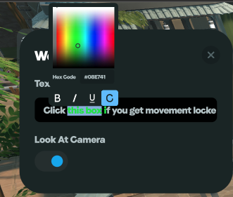

# Build Block

### Overview

The Build Block is a resizable cube used for constructing environments or decor. You can apply a custom image texture, select from predefined textures, or use a color picker to choose any solid color.

### Inventory Settings

#### Texture/Color Selection Interface

* Image Texture Cube:
  * Paste Image URL – Apply a texture by pasting a direct image URL.
  * Drag & Drop – Upload a custom image for use as a texture.
  * Browse Files – Select and upload a texture file from your device.
  * Choose From Gallery – Pick from predefined textures
* Color Select Cube:
  * Choose the color select cube icon 

### Placement Settings

Two possible configuration menus depending on selection:

#### _If using a texture (uploaded or predefined):_

* Texture Tiling – Controls how many times the texture repeats across the block’s surface.
* Transparency – Adjusts the cube’s transparency level.
* Collider on – Enables or disables physical collision.
* Emission – Controls glow/light emission from the cube.
* Shadow on – Enables or disables shadows.
* Make AI Walkable – Allows AI characters & Enemy NPCs to walk over the surface.
* Custom Title – Optional field to label the object.

#### _If using the color picker (color cube icon):_

* Cube Color – Sets the block color using a full-spectrum color picker.
* Transparency – Adjusts the cube’s transparency level.
* Collider on – Enables or disables physical collision.
* Emission – Controls glow/light emission from the cube.
* Shadow on – Enables or disables shadows.
* Make AI Walkable – Allows AI characters & Enemy NPCs to walk over the surface.
* Custom Title – Optional field to label the object.

### Common Use Cases

* Building walls, platforms, and architectural structures
* Creating decorative props and themed environments
* Defining invisible collision areas or walkable terrain for NPCs
