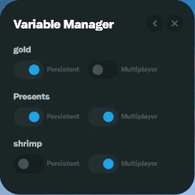

# Variable Manager

You can manage all of your variables created with the [Update Value](../../interactive-studio/effects/update-value.md) effect in the variable manager including setting whether the value is persistent and if it is multiplayer. By default all values created are single player and non-persistent.

<figure><figcaption></figcaption></figure>

Persistent Values: The value will be stored across sessions (i.e. if you refresh or leave the game the value will stay the same).

Multiplayer Values: All players will share the same value.

### Initializing Variables

Variables in Portals do not have a built-in "default value" setting. To initialize a variable to a starting value, create a trigger with the **Player Login** event and use a **SetVariable** effect (via Function Effect) or **Update Value** effect to set the initial value. This ensures all players start with the correct variable state when they join.

Example initialization with Function Effect:
```
SetVariable('Player_Score', 0.0, 0.0)
SetVariable('Player_Team', 0.0, 0.0)
```
