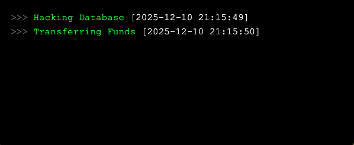

# 🛜 Send Message to Iframes

## Overview

The "Send Message to Iframes" feature enables one-way communication from Portals to embedded iframes. This allows Portals to send custom text strings to the iframe, which can then process or react to these messages. This complements the existing iframe-to-Portals messaging (using <mark style="color:orange;">PortalsSdk.sendMessageToUnity</mark>), providing bidirectional communication capabilities for more interactive experiences.

Use cases include:

* Updating iframe content dynamically based on Portals events.
* Passing data like user inputs, game states, or notifications to web-based overlays.
* Triggering actions within mini-games or integrated web flows.

**Note:** This feature requires the Portals SDK to be loaded in the iframe. Messages are sent as plain text strings from Portals to the iframe.

### Message Variables

The Message field supports variable placeholders using pipe syntax. Any text wrapped in | characters will be replaced with its current value at the moment the effect fires, and the final result is sent to the iframe as a plain text string.

#### Syntax

* Format: |variableName|
* Example: Hello |username|

#### Built-in Variable

* |username|: Sends the player’s identifier as a quoted string.
  * If the player has a Portals ID set, that value is used.
  * Otherwise, the player’s name is used.
  * Example value: "bus"

#### Examples

| Send to Message input                             | Sent to iframe                  |
| ------------------------------------------------- | ------------------------------- |
| Hello \|username\|                                | Hello "bus"                     |
| user=\|username\| level=\|level\| coins=\|coins\| | user="bus" level=3 coins=125    |
| {"score":\|score\| , "username":\|username\|}     | {"score":10 , "username":"bus"} |

## SDK Integration

To receive messages in your iframe, include the Portals SDK script in your HTML file. This loads the <mark style="color:orange;">PortalsSdk</mark> object globally.

```html
<script src="https://portals-labs.github.io/portals-sdk/portals-sdk.js?v=10005456"></script>
```

* **Placement**: Add this script tag in the <mark style="color:orange;">\<head></mark> or before your custom scripts in the <mark style="color:orange;">\<body></mark>.
* **Versioning**: The <mark style="color:orange;">?v=10005456</mark> parameter helps with cache busting; update it if needed for new SDK versions.

## Receiving Messages in the Iframe

In your iframe's JavaScript, set up a message listener using <mark style="color:orange;">PortalsSdk.setMessageListener</mark>. This registers a callback function that triggers whenever a message is received from Portals.

* **Method**: <mark style="color:orange;">PortalsSdk.setMessageListener(callback)</mark>
* **Parameters**:
  * <mark style="color:orange;">callback</mark>: A function that receives the message as a string parameter.
* **Behavior**: The callback is invoked with the raw text string sent from Portals. You can then parse, log, or act on it (e.g., update UI, trigger events).

### Example Usage

```javascript
PortalsSdk.setMessageListener((message) => {
  console.log("Received message from Portals: " + message);
  // Example: Update a DOM element with the message
  document.getElementById('message-display').textContent = message;
});
```

* **Full HTML Example:**

```html
<!DOCTYPE html>
<html lang="en">
<head>
    <meta charset="UTF-8">
    <meta name="viewport" content="width=device-width, initial-scale=1.0">
    <title>Message Receiver Iframe</title>
    <script src="https://portals-labs.github.io/portals-sdk/portals-sdk.js?v=10005456"></script>
</head>
<body>
    <h1>Portals Message Receiver</h1>
    <div id="message-display">Awaiting message...</div>
    <script>
        PortalsSdk.setMessageListener((message) => {
            console.log("PORTALS MSG: " + message);
            document.getElementById('message-display').textContent = message;
        });
    </script>
</body>
</html>
```

In this example:

* The SDK is loaded.
* A listener is set to log the message and update a \<div> element.
* When Portals sends a message (e.g., "Hello from Portals"), it will appear in the console and on the page.

## Sending Messages from Portals

From the Portals side, use the "Send Message To Iframes" effect to send messages to the iframe. This effect can be triggered based on any of the available triggers.

## Configuration

***

| Setting | Permitted Values | Description                                           |
| ------- | ---------------- | ----------------------------------------------------- |
| Message | text string      | Enter the text string that will be sent to the iframe |

## Requirements and Compatibility

***

### Compatability

<table><thead><tr><th width="210">Object Type</th><th width="199" align="center">Compatibility</th></tr></thead><tbody><tr><td>Trigger Cube</td><td align="center"><span data-gb-custom-inline data-tag="emoji" data-code="2705">✅</span></td></tr><tr><td>Building Cube</td><td align="center"><span data-gb-custom-inline data-tag="emoji" data-code="2705">✅</span></td></tr><tr><td>Nine Cube</td><td align="center"><span data-gb-custom-inline data-tag="emoji" data-code="2705">✅</span></td></tr><tr><td>Custom Import</td><td align="center"><span data-gb-custom-inline data-tag="emoji" data-code="2705">✅</span></td></tr><tr><td>NPC</td><td align="center"><span data-gb-custom-inline data-tag="emoji" data-code="2705">✅</span></td></tr></tbody></table>

### Requirements

* **Environment**: The iframe must be within Portals. Testing in a regular browser may work for basic logging but could throw errors for other SDK features.
  * **Compatibility Note**: The listener uses standard mechanisms like postMessage, so it should function in most modern browsers, but full integration requires Unity.
* **User Gestures**: Unlike sending messages to Unity, receiving messages does not require user interactions. The listener can be set on page load.
* **Message Format**: Only plain text strings are supported.

## Troubleshooting

* **SDK Not Loaded**: If PortalsSdk is undefined, confirm the script tag is present and the URL is accessible (check for network errors).
* **No Messages Received**:
  * Verify the listener is set before messages are sent.
  * Ensure the iframe is correctly setup in Portals.

## Resources

You can place the following url as an iframe into your space to test the Send Message to Iframes effect is firing properly in-game

```
https://portalsterminal.replit.app/?noBlur=true&height=300&left=10&top=10&width=600
```

<figure><figcaption></figcaption></figure>

This will post the message sent in green along with a timestamp of when the message was received.&#x20;
