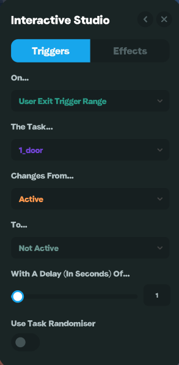

# Multiplayer Tasks

Multiplayer tasks are tasks where every user can see the effects following a state change, regardless of who triggers it.. Take the below example of a door opening, if the task is setup as a multiplayer task after any user clicks on the door, all users can see it open.

<strong>Example #1 - Interactive Door</strong>

**Objects**

For this example we will us an animated door and a trigger cube placed in the doorway. The door will simply swing open for its animation.

**Tasks**

We will just one multiplayer task called "door".

**Triggers**

We will setup the following trigger on the _**animated door**_.

&#x20;

This will make it so when a user clicks the door  the task "door" will change from not active to active.

We will setup the following trigger on the _**trigger cube**._

This will make it so when a user exits the trigger cube zone the task "door" will change from active to not active, with a 1 second delay. We add the delay mainly to give users time to get away from the door.

**Effects**

We then will add the following effects to the _**animated door.**_

We setup the animation to play once at the speed and direction of -1 when the task "door" is in the not active state. This will mean the door animation will play in reverse at 100% speed, giving it the appearance of closing.

We setup the animation to play once at the speed and direction of 1 when the task "door" is in the active state. This will mean the door animation will play in normally at 100% speed, giving it the opening animation.

**Final Result**

We have now setup a door that will open when you click on it and, close when you walk through it.

