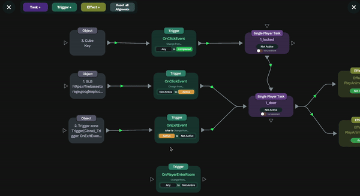
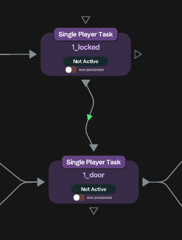
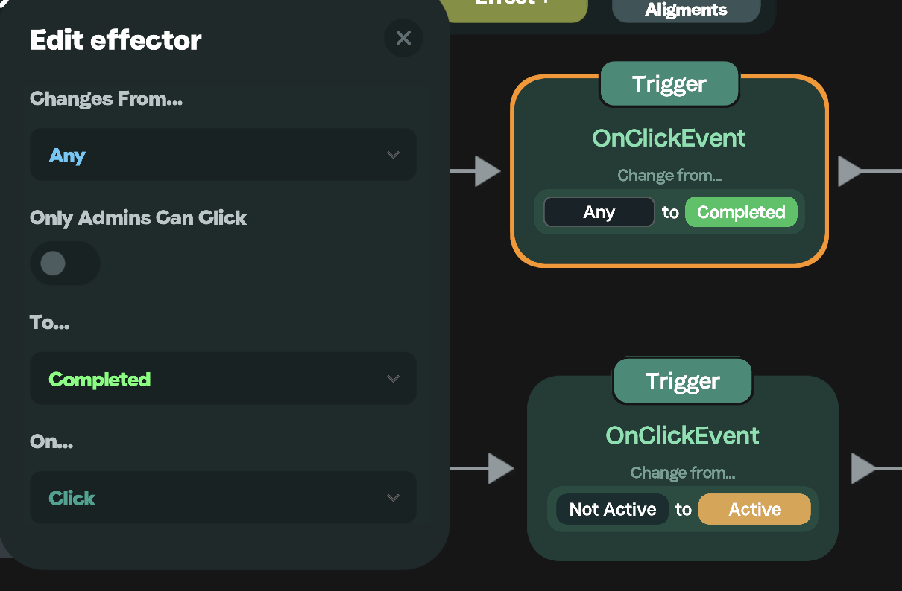

# Node View

## Usage

The Node View Can be accessed by going to Space Options > Tasks and clicking the 'Graph' button located at the bottom of the menu. The node view is extremely helpful in analyzing you setup, locating any bugs, and checking the overall game logic.

Node View Key

* Grey icons represent objects
* Green icons represent Triggers
* Purple icons represent Tasks
* Yellow icons represent Effects

<figure><figcaption></figcaption></figure>

You can also use the node view to directly add Tasks, Triggers, and Effects. Simply select the type of component you would like to add.

<figure><figcaption></figcaption></figure>

Then drag the arrows to connect the component to the object and task, and configure the settings.

<figure><figcaption></figcaption></figure>

## Tasks

You can use the Node View to see the current state of any task, whether its single player or multiplayer, and whether or not its persistent.&#x20;

<figure><figcaption></figcaption></figure>

You can also see task dependancies represented on the node view by an arrow going from the bottom of one task into the top of the other. The task with the arrow coming out the bottom is the dependent task of the one with the arrow going in the top. So, in this case the task "door" is dependent on the task "locked".

<figure><figcaption></figcaption></figure>

## Triggers

The trigger icons display the type of trigger, along with the state change it executes. The incoming arrow is the object the trigger is configured on. By clicking on the trigger icons you edit the setup within the Node View.

<figure><figcaption></figcaption></figure>

## Effects

You can see on the effect icons the state the task (incoming arrow) needs to be in, in order for the  effect to take place and the effect itself. The outgoing arrow is the object the effect will take place on. By clicking on the effect you can configure its settings.

<figure><figcaption></figcaption></figure>

